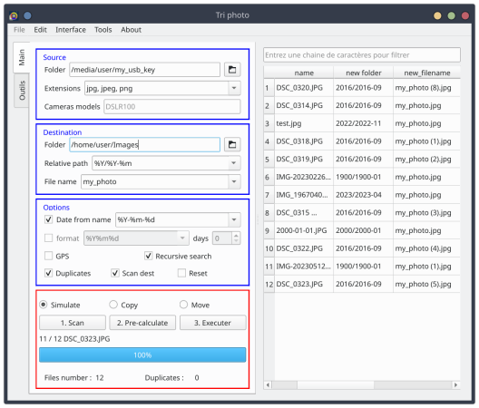

# Tri photo date

## A propos

Le programme propose via une interface de trier vos dossiers de photos en s'appuyant sur leur métadonnés. 
On peut y définir des chemins personnalisés qui sont fonctions des métadonnées propres à chaque photos.

Selon les options activées, le programme réalise dans l'ordre :

1. Calcul des empruntes des fichiers pour identification de doublons (md5)
2. Récupèration les métadonnées
3. Résolution du nom de lieu/addresse de la prise de vue à l'aide des coordonnées gps (module geopy et le service [Nominatim proposé par OpenStreetMap](https://nominatim.openstreetmap.org/ui/search.html)
4. Genèration d'un nouveau chemin d'enregistrement de la photos
5. Copie de la photo

## Install

### Binaries

Compiled binaries are avaible to download for both linux and windows. No dependancies required, no install needed

### Python package

With poetry:

```shell
git clone https://github.com/Daguhh/tri_photo_date.git
cd tri_photo_date
poetry install
```

```shell
some tri_photo_date command
```

### As source code 

In a virtual environnement :

```shell
git clone https://github.com/Daguhh/tri_photo_date.git
cd tri_photo_date
poetry shell
poetry install --no-root
```
```shell
python3 tri_photo_date
```

## Utilisation

 

## Files

Tri-photo-date generated files:

| File | Path | Description |
|------|------|-------------|
| config.ini | APPDATA/triphotodate | Store user parameters |
| gps.db | APPDATA/triphotodate | Cache for gps data (prevent unnecessay call to nominatim api) |
| triphotodate.log | ??????? | program log file |


