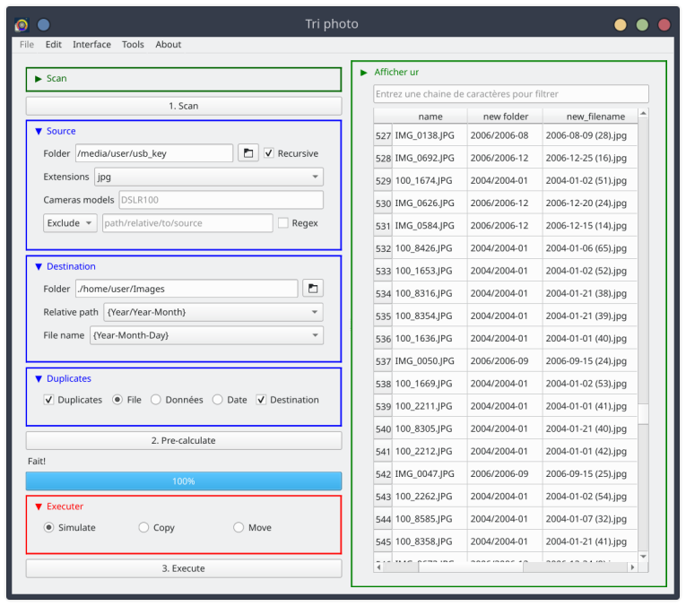

# Tri photo date

## Foreword

Program is still in progress, please make copies of your photo before using. Nevertheless most function shoud work well at this time.
So feel free to give any feedbacks.

## About

The program offers, through an interface, to sort your photo folders based on their metadata. 
Paths can be customized with placeholders to be then replaced by datas specific to each photo.

Depending on the options enabled, the program achieves in order:

1. Calculation of file fingerprints for duplicate identification (md5) 
2. Recover metadata 
3. Resolution of the location name/addresse of the shotting using gps coordinates (module geopy and the service [Nomeinatim proposed by OpenStreetMap](https://nominatim.openstreetmap.org/ui/search.html) 
4. Generation of a new path to record photos 
5. Copy of the photo



## Run & Install

### Binaries

Compiled binaries are avaible to download for both linux and windows. No dependancies required, no install needed

### Python package

With poetry:

```shell
git clone https://github.com/Daguhh/tri_photo_date.git
cd tri_photo_date
poetry install
```

```shell
tri_photo_date
```

### As source code 

In a virtual environnement :

```shell
git clone https://github.com/Daguhh/tri_photo_date.git
cd tri_photo_date
poetry shell
poetry install --no-root
```
```shell
python3 tri_photo_date
```

## Usage

### Simplified mode

1. Fill source and destination sections, set path,  choose preselection using combobox
2. Run **'1. Scan'** : it will search for all medias in those folders.
3. Run **'2. Pre-calculate'** : program generate output path for you images and fill preview pane
4. CHeck preview pane using vertical button on the right. Repeat previous step until you're fine with parameters
5. Choose if you want to simulate/copy/move files 
6. Run **'3. Execute'** : program will perform action you choose, wait until it ends

### Advanced mode

Here is typicals steps users should perform to run the program:

1. Find files, set up filters and fill options
    1. Fill **source** folder and **destination** folder 
    2. Run **'1. Scan'** : it will search for all medias in those folders, it will also populate the **tools** tab
    3. Go to **tools** tab. In the differents toolboxes, you will find all necessary datas to inform remaining 
    fields in sections **source** and **destination** in **main** tab. 
    Use checkbox when you can or use copy/paste to get placerholders, (or fill all manually).
    4. Set **options** section, use tootlip to get information on waht to do.
2. Compute new paths for files
    1. Run **'2. Pre-calculate'** : it will use all parameters to pre-generate path where to move photos.
    It include getting photo metadata, resolving location, replacing placerholders and all options you checked.
    2. On right side click the vertical button "Show preview". It will display a table showing gathered 
    data and calculated folders and filenames for each photos.
    3. Adapt parameters in **main** tab if needed and re-run **2. Pre-calculate** until you fine with the parameters.
3. If you're fine with the result, execute
    1. Please check if you simulate/copy/move the files and run **3. Execute**. Wait until the process end.
    2. You can quit, parameters are automaticly saved for next section.

### Command line

A small command line utility is available. It's not very elaborate at the moment, but it should allow dealing with multiple preconfigurations to run scripts in the daily routine

```shell
usage: tri_photo_date [-h] [--cli] [-d [DUMP] | -D [DUMP_DEFAULT] | -l [LOAD]]

Sort image using metadata placeholder

options:
  -h, --help            show this help message and exit
  --cli                 run in cli
  -d [DUMP], --dump [DUMP]
                        save actual config to path and exit
  -D [DUMP_DEFAULT], --dump-default [DUMP_DEFAULT]
                        save default config to path and exit
  -l [LOAD], --load [LOAD]
                        run the program with given config
```


## Files

Tri-photo-date generated files:

| File             | Path                       | Description                  | 
|------------------|----------------------------|------------------------------|
| config.ini       | APPDATA/triphotodate       | Store user parameters        |
| gps.db           | LOCALAPPDATA"/triphotodate | Cache for gps data (prevent unnecessay call to nominatim api) |
| images.db        | LOCALAPPDATA"/triphotodate | Cache for images datas and store datas during process |
| triphotodate.log | ???????                    | program log file             |

## Credits

### Embed dependancies

- Interface : [PyQt5](https://www.riverbankcomputing.com/software/pyqt/) -  [GNU GPL v3](https://www.gnu.org/licenses/gpl-3.0.en.html)
- Handling Exifs : [pyexiv2](https://github.com/LeoHsiao1/pyexiv2) - [GNU GPL v3](https://www.gnu.org/licenses/gpl-3.0.en.html)
- Addresses resolution: [geopy](https://geopy.readthedocs.io/en/stable/) - [MIT](https://opensource.org/license/mit/)
- SSL certificates : [certifi](https://github.com/certifi/python-certifi) - [MPL](http://mozilla.org/MPL/2.0/)

### Oneline service

This program use the [OpenStreetMap nominatim](https://nominatim.openstreetmap.org/ui/search.html) service for resolving addresses from GPS coordinates:
- Consult [Copyright](https://www.openstreetmap.org/copyright)
- Consult [Usage policy](https://operations.osmfoundation.org/policies/nominatim/)
- Consult [Privacy policy](https://wiki.osmfoundation.org/wiki/Privacy_Policy) du service

